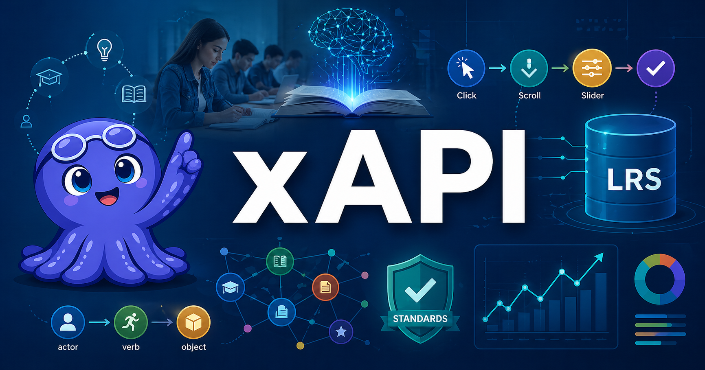

# Welcome

<figure markdown>
  { width="100%" }
</figure>

Welcome to **xAPI for Intelligent Textbooks**. Most software watches what
users *click*. xAPI watches what they *learn* — and once you can write,
store, and query learning statements, you can answer questions traditional
analytics can't even ask.

## About This Book

This is a hands-on course for software professionals — web developers,
instructional technologists, learning engineers, and platform architects —
who are building or extending Level 3 interactive intelligent textbooks and
want to instrument them with xAPI for detailed learner analytics.

You'll learn to design Actor/Verb/Object statements, stand up a Learning
Record Store (LRS), instrument simulations and quizzes, optimize
bandwidth on constrained networks, and build the observability tooling
that turns raw statement logs into actionable insight.

## Who This Book Is For

- Web developers comfortable in JavaScript/TypeScript and REST/JSON
- Instructional technologists and learning engineers
- Platform architects designing learning analytics infrastructure
- Anyone building Level 3 intelligent textbooks who wants to capture
  fine-grained learner behavior in a standards-based way

No prior knowledge of xAPI or learning standards is required. Familiarity
with generative AI coding assistants (e.g., Claude Code) is helpful but
not required.

## How to Use This Book

Use the navigation sidebar on the left to explore:

- **[Chapters](chapters/index.md)** — the main body of the book, in
  dependency order so prerequisites are always covered first
- **[Learning Graph](learning-graph/index.md)** — an interactive map of
  how concepts connect
- **[MicroSims](sims/index.md)** — interactive simulations, each focused
  on a single concept and embeddable as an iframe
- **Glossary** — precise, non-circular definitions for every key term
- **About** — audience, prerequisites, and how to read the book

## Getting Started

Start with [Chapter 1: Foundations and
Standards](chapters/01-foundations-and-standards/index.md) and work
forward in order. The book is designed so each chapter unlocks a new
capability — by the end, you'll be able to instrument an intelligent
textbook end-to-end and reconstruct any learner's session in order,
across devices, months later.
