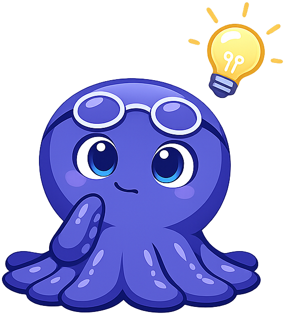
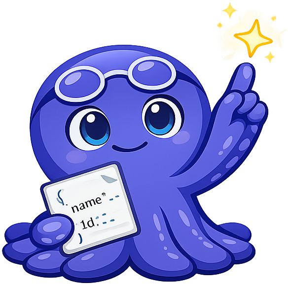
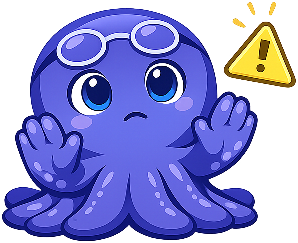

# Mascot Style Guide

This page shows all mascot admonition styles for **Xavi the Octopus**, the
pedagogical agent for *xAPI for Intelligent Textbooks*. Use it to verify
that images load, colors render correctly, and text wraps cleanly around
the floated mascot image.

---

!!! mascot-neutral "A Note from Xavi"
    
    This is the **neutral** style — use it for general sidebars, introductions,
    or any content that doesn't call for a specific emotional tone.

---

!!! mascot-welcome "Welcome to This Chapter!"
    
    This is the **welcome** style — use it at the opening of every chapter.
    Xavi introduces what's ahead and gets students excited to dive in.
    Every interaction tells a story!

---

!!! mascot-thinking "Key Insight"
    
    This is the **thinking** style — use it for key concepts and important
    insights. An xAPI statement is always an Actor–Verb–Object triple:
    *who* did *what* to *what object*. That simple model underpins the
    entire specification.

---

!!! mascot-tip "Xavi's Tip"
    
    This is the **tip** style — use it for helpful hints. Always batch
    xAPI statements during high-frequency interactions (simulations, games)
    to keep network overhead negligible.

---

!!! mascot-warning "Watch Out!"
    
    This is the **warning** style — use it for common mistakes. Don't store
    Personally Identifiable Information (PII) in Actor `name` fields without
    reviewing your organization's FERPA/GDPR obligations first.

---

!!! mascot-encourage "You've Got This!"
    
    This is the **encouraging** style — use it near difficult content.
    LRS architecture can feel complex at first, but once you understand
    the statement lifecycle, everything else clicks into place.

---

!!! mascot-celebration "Well Done!"
    
    This is the **celebration** style — use it at the end of chapters or
    major sections. You've just mastered the foundations of xAPI statement
    design — one of the most powerful skills in modern learning engineering!

---

## Image Border Debug View

The section below adds a red border around each mascot image so you can
inspect padding and bounding-box alignment. Remove this section from the
page once images look correct.

!!! mascot-neutral "Debug — Neutral"
    
    Red border shows the image bounding box. If you see large empty areas
    inside the border, run the trim-padding script.

!!! mascot-celebration "Debug — Celebration"
    
    The celebration admonition uses a dark purple background so pale confetti
    sparkles remain visible. Confirm the character and confetti are legible here.

