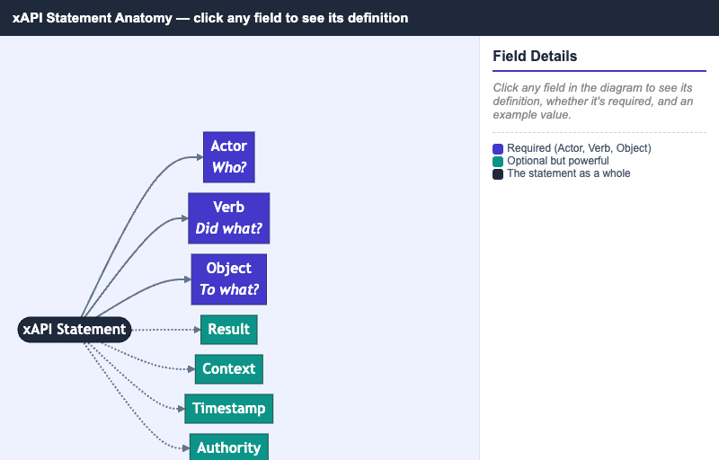

# MicroSims

MicroSims are small, interactive educational simulations — each one focused on
a single concept. They live under `docs/sims/<sim-name>/` and are embedded
into chapters via iframes.

New MicroSims can be created with the `microsim-generator` skill, which routes
to the appropriate library (p5.js, Chart.js, vis-network, Mermaid, Leaflet,
Plotly, Venn.js).

<!-- The MicroSim catalog is built up as new sims are added. 
Note that the image and description MUST be indented! -->

- **[xAPI Statement Triple](./xapi-statement-triple/index.md)**

    

    Shows the three key elements of an xAPI statement: Who did what to what?.

